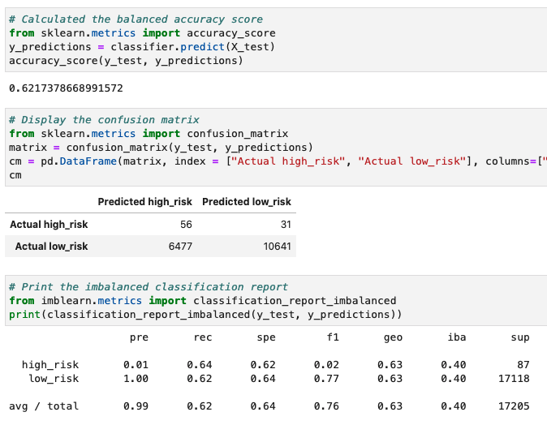
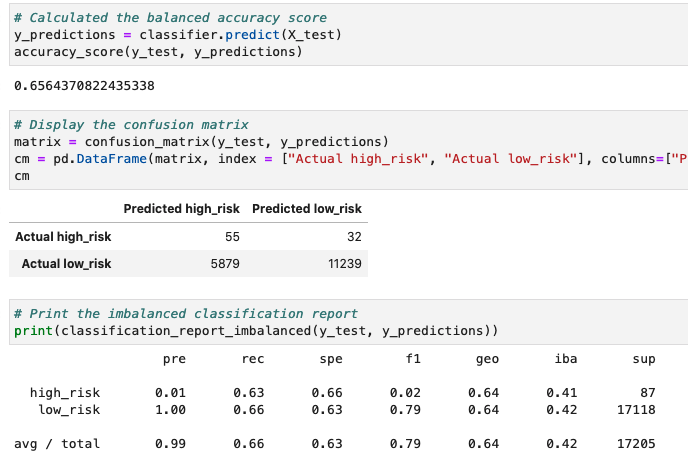
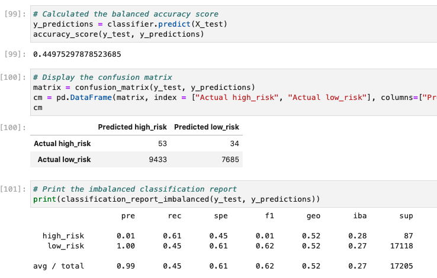
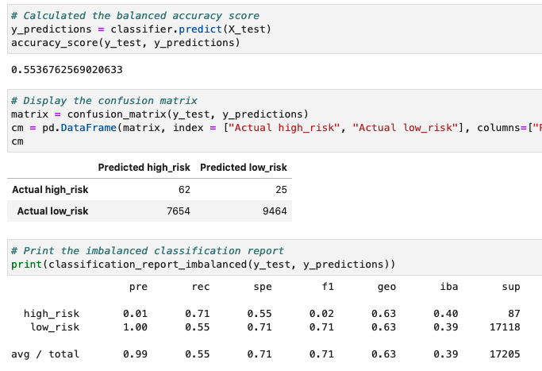
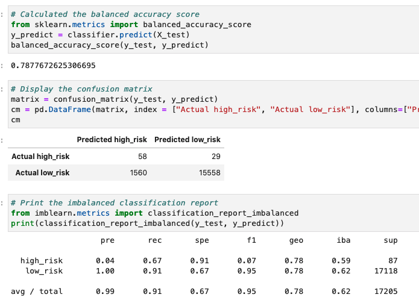
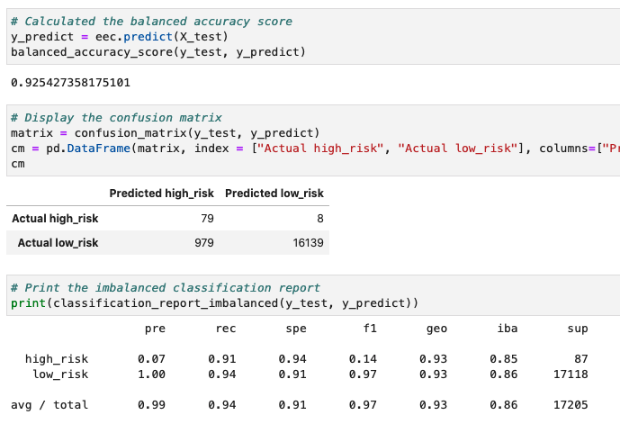

# Credit_Risk_Analysis

Reference website:

[BalancedRandomForestClassifier](https://imbalanced-learn.org/stable/references/generated/imblearn.ensemble.BalancedRandomForestClassifier.html)

[EasyEnsembleClassifier](https://imbalanced-learn.org/stable/references/generated/imblearn.ensemble.EasyEnsembleClassifier.html)

---

### 1. Overview of the analysis: Explain the purpose of this analysis. 

The purpose of this analysis is to demonstrate skills in data preparation, statistical reasoning, and machine learning. With imbalanced-learn and scikit-learn libraries to build models using resampling, we will employ different techniques to train and evaluate models with unbalanced classes.

### 2. Results: Using bulleted lists, describe the balanced accuracy scores and the precision and recall scores of all six machine learning models. Use screenshots of your outputs to support your results.

- Naive Random Oversampling:
 - Accuracy Score: 62.1%
 - High Risk Precision: 1%
 - High Risk Recall: 64%

 
 
- SMOTE Oversampling
 - Accuracy Score: 65.6%
 - High Risk Precision: 1%
 - High Risk Recall: 63%

- Undersampling
 - Accuracy Score: 44.97%
 - High Risk Precision: 1%
 - High Risk Recall: 61%

- Combination (Over and Under) Sampling
 - Accuracy Score: 55.37%
 - High Risk Precision: 1%
 - High Risk Recall: 71%

- Balanced Random Forest Classifier
 - Accuracy Score: 78.78%
 - High Risk Precision: 4%
 - High Risk Recall: 67%

- Easy Ensemble AdaBoost Classifier
 - Accuracy Score: 92.55%
 - High Risk Precision: 7%
 - High Risk Recall: 91%

### 3. Summary: Summarize the results of the machine learning models, and include a recommendation on the model to use, if any. If you do not recommend any of the models, justify your reasoning.

In my opinion, out of the six models, Easy Ensemble AdaBoost Classifier was the one that out-performed the other models with high risk recall of 91%. (Which in this case, we care about recall very much because we want the model to have high accuracy of predicting high_risks. (Out of 87 actual high_risks, the model is able to capture 79). However, too many of the low risks were incorrectly detected as high risks. This will potentially cause a lot of unnecessary trouble to the lender. 